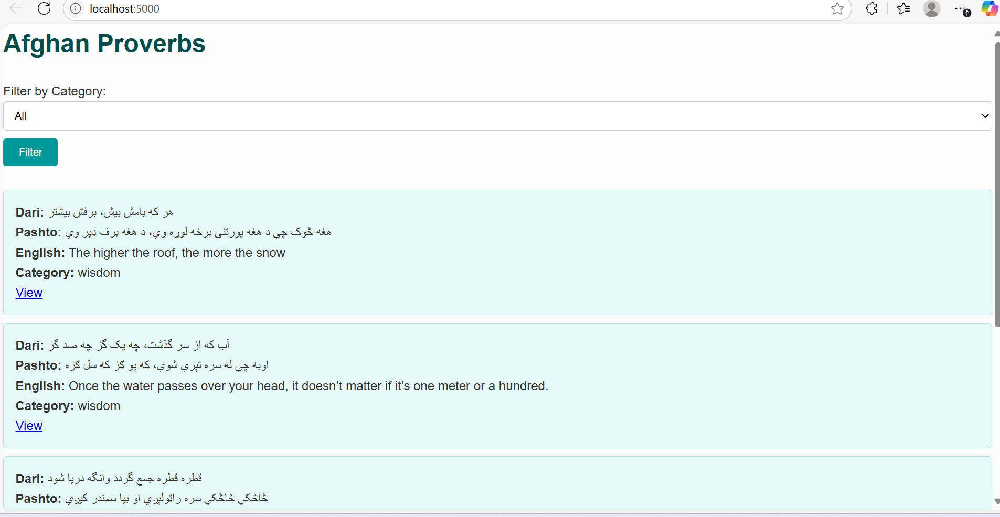
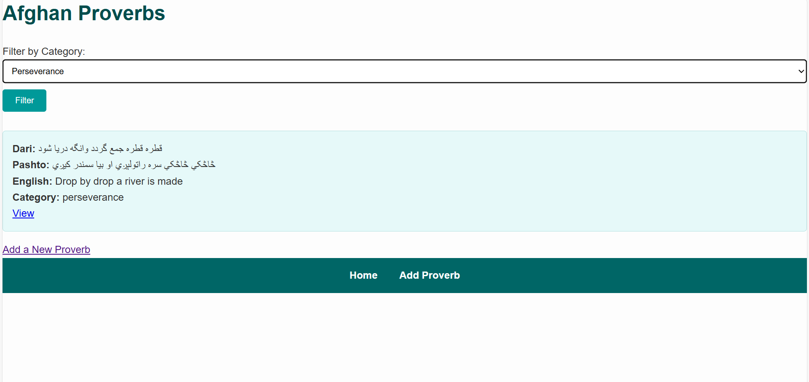
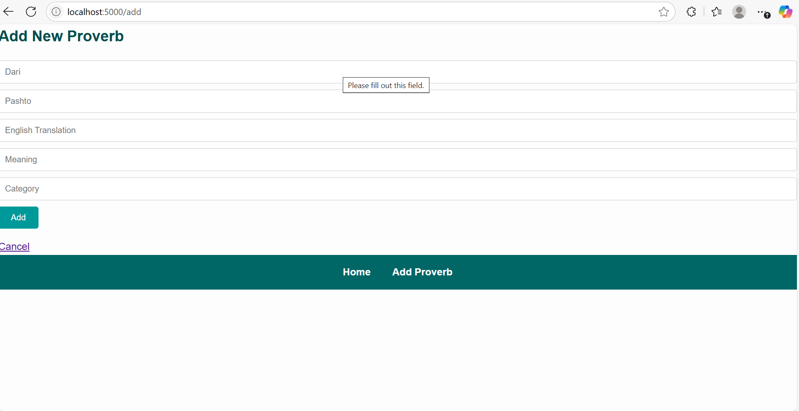
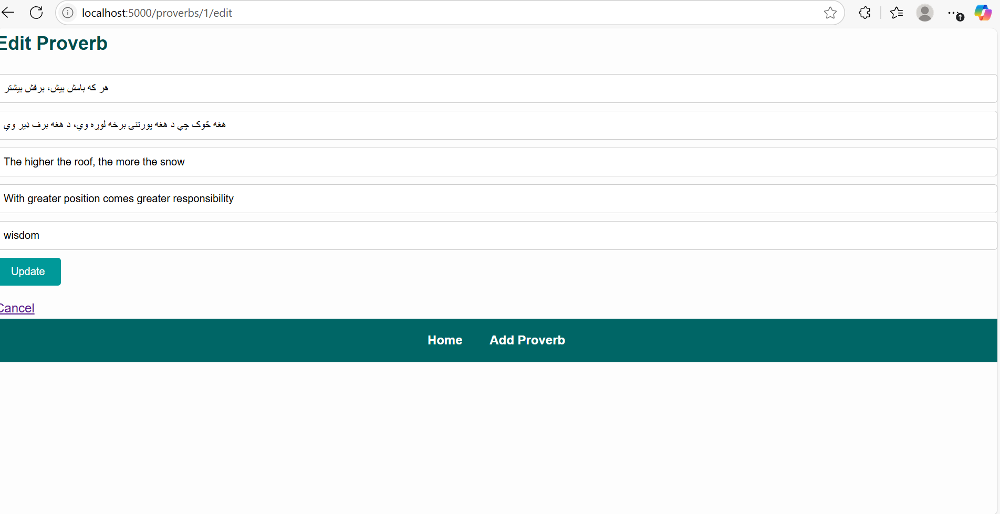
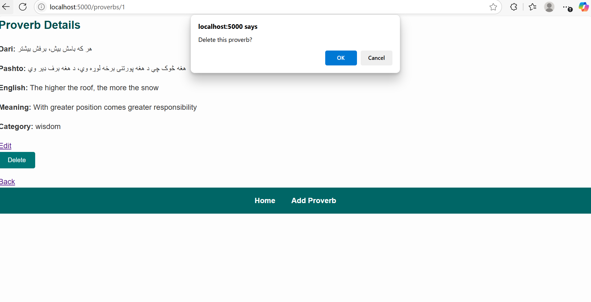

# 🌿 Proverbs Frontend App

---
This is a full-stack web application for browsing, adding, editing, and managing proverbs. Built with Express.js for the backend and a modern frontend (deployed on Render), the app provides an intuitive interface to interact with a collection of categorized proverbs.

The frontend communicates with the backend API (also deployed on Render) using **Axios** for smooth and efficient data handling. This project emphasizes clean UI/UX, RESTful API design, and modular, maintainable code structure.

> 🔗 Live Demo: https://proverbs-frontend.onrender.com

Whether you're looking to explore wise sayings or build your CRUD development skills, this app delivers both functionality and learning.

---

## 📌 Project Description

This project presents a clean and interactive user interface for managing proverbs stored on a remote server. Users can:

- View all proverbs
- Filter proverbs by category
- Add new proverbs
- Edit existing ones
- Delete proverbs

The app communicates with a RESTful API using **AXIOS** and dynamically updates the DOM based on user interactions.

---

## 🔗 Live Demo

- 🔗 **Frontend (Render)**:  https://proverbs-frontend.onrender.com
- 🔗 **Backend API (Render)**: https://afghan-proverbs-api-pt1q.onrender.com/proverbs

---
## 🛠️ Instructions to Run the Project 

## 🚀 How to Run the Project
This project consists of two parts:

- 🌐 A backend API built with Express.js
- 💻 A frontend application using Axios to interact with the backend

You can run both locally or use the deployed versions.

---

### 🌐 Online Deployment (No Setup Required)

- ✅ **Frontend Live**: [https://proverbs-frontend.onrender.com](https://proverbs-frontend.onrender.com)
- ✅ **Backend API Live**: [https://afghan-proverbs-api-pt1q.onrender.com/proverbs](https://afghan-proverbs-api-pt1q.onrender.com/proverbs)

Everything is connected and functional online — just open the frontend link in your browser.

---

### 🖥️ Running the Project Locally

#### 📦 Backend Setup (Optional - Already Deployed)

The backend is deployed on Render and already integrated with the frontend, but you can run it locally if needed.

##### 1️⃣ Clone the backend repository

```
git clone https://github.com/Maria873324/Afghan-proverbs-api.git
cd Afghan-proverbs-api
```

##### 2️⃣ Install dependencies
```
npm install
```

#### 3️⃣ Start the server 
npm start

# ⚠️
The backend will run at:
http://localhost:3001/proverbs
If running locally, don’t forget to change the API base URL in the frontend Axios config from the Render URL to: http://localhost:3001/proverbs

---

## 💻 Frontend Setup

### 1️⃣ Clone the frontend repository

git clone https://github.com/Maria873324/proverbs-frontend.git

cd proverbs-frontend

### 2️⃣ Install dependencies
npm install

### 3️⃣ Start the app
npm start


The frontend will run at:
http://localhost:5000
``

# 📦 Features
```
. 🔍 Browse all proverbs

. 📂 Filter by category using query parameters (e.g., /proverbs?category=wisdom)

. ➕ Add new proverbs

. 📝 Update existing proverbs

. ❌ Delete proverbs

---

# 🧠 Technologies Used
```
1.  Axios for HTTP requests

2.  Express.js (backend)

3.  JSON file storage

4.  Render for deployment
--- 

# 🧪 Bonus Features
```
✅ Filter proverbs by category using query parameters

---
```
## 📸 Screenshots

### 🏠 Home Page



### 🔍 Filter by Category



### ➕ Add Proverb Form



### 📝 Edit Proverb



### ❌ Delete Proverb Confirmation



### 📄 Proverb Details


